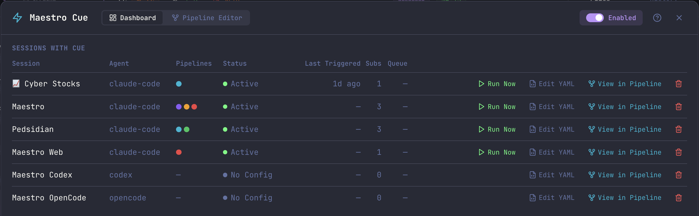
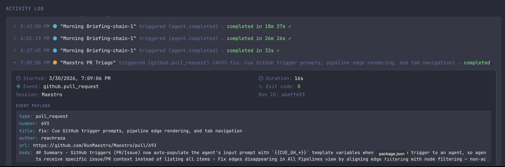
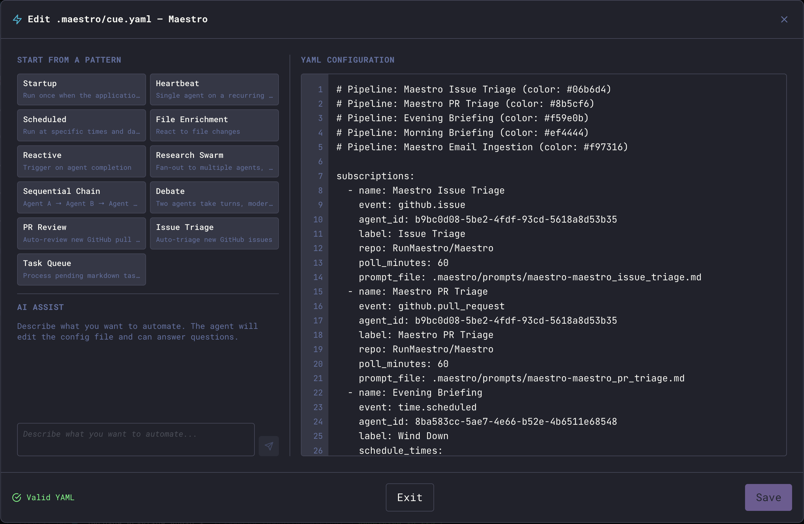
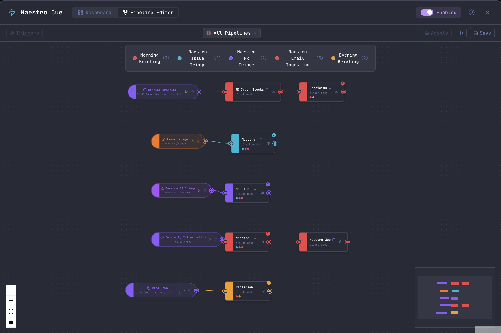
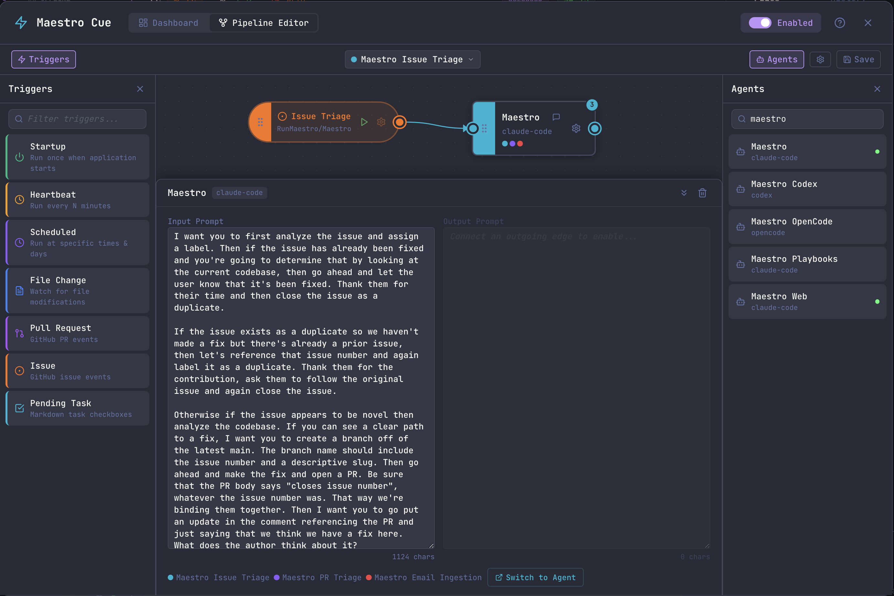

Maestro Cue is an event-driven automation engine that watches for things happening in your projects and automatically sends prompts to your agents in response. Instead of manually kicking off tasks, you define **subscriptions** — trigger-prompt pairings — in a YAML file, and Cue handles the rest.

<Note>
Maestro Cue is an **Encore Feature** — it's disabled by default. Enable it in **Settings > Encore Features** to access the shortcut, modal, and automation engine.
</Note>

## What Can Cue Do?

A few examples of what you can automate with Cue:

- **Run linting whenever TypeScript files change** — watch `src/**/*.ts` and prompt an agent to lint on every save
- **Generate a morning standup** — schedule at 9:00 AM on weekdays to scan recent git activity and draft a report
- **Chain agents together** — when your build agent finishes, automatically trigger a test agent, then a deploy agent
- **Triage new GitHub PRs** — poll for new pull requests and prompt an agent to review the diff
- **Track TODO progress** — scan markdown files for unchecked tasks and prompt an agent to work on the next one
- **Fan out deployments** — when a build completes, trigger multiple deploy agents simultaneously
- **Trigger from the CLI** — run `maestro-cli cue trigger` to fire a subscription on demand from scripts, CI/CD, or other agents

## Enabling Cue

1. Open **Settings** (`Cmd+,` / `Ctrl+,`)
2. Navigate to the **Encore Features** tab
3. Toggle **Maestro Cue** on

Once enabled, Maestro automatically scans all your active agents for `.maestro/cue.yaml` files in their project roots. The Cue engine starts immediately — no restart required.

## Quick Start

Create a file called `.maestro/cue.yaml` in your project (inside the `.maestro/` directory at the project root):

```yaml
subscriptions:
  - name: lint-on-save
    event: file.changed
    watch: 'src/**/*.ts'
    prompt: |
      The file {{CUE_FILE_PATH}} was just modified.
      Please run the linter and fix any issues.
```

That's it. Whenever a `.ts` file in `src/` changes, Cue sends that prompt to the agent with the file path filled in automatically.

## The Cue Modal

Open the Cue dashboard to monitor and manage all automation activity.

**Keyboard shortcut:**

- macOS: `Option+Q`
- Windows/Linux: `Alt+Q`

**From Quick Actions:**

- Press `Cmd+K` / `Ctrl+K` and search for "Maestro Cue"

The modal has two tabs: **Dashboard** and **Pipeline Editor**. An **Enabled** toggle in the header lets you start and stop the engine globally.

### Sessions Table

The Dashboard tab shows all agents with Cue configurations:



| Column             | Description                                                  |
| ------------------ | ------------------------------------------------------------ |
| **Session**        | Agent name                                                   |
| **Agent**          | Provider type (Claude Code, Codex, OpenCode, etc.)           |
| **Pipelines**      | Color-coded dots for each pipeline configured on this agent  |
| **Status**         | Green = active, yellow = paused, "No Config" = no YAML found |
| **Last Triggered** | How long ago the most recent event fired                     |
| **Subs**           | Number of subscriptions in the YAML                          |
| **Queue**          | Events waiting to be processed                               |

Each row has three action buttons:

- **Run Now** — Manually trigger a subscription on demand
- **Edit YAML** — Open the inline YAML editor for that agent
- **View in Pipeline** — Jump to the Pipeline Editor filtered to that agent

### Run Now

Each subscription row in the Sessions Table has a **Run Now** button that manually triggers it, bypassing its normal event conditions. This is useful for testing new subscriptions or re-running a failed automation without waiting for the next event.

### Activity Log

A chronological record of completed and failed runs. Click any entry to expand full details including the event payload, run ID, and exit code.



Each entry shows:

- Subscription name and trigger type (e.g. `[github.pull_request]`)
- Status (completed, failed, timeout, stopped)
- Duration
- Timestamp

Expand an entry to see the full event data — for GitHub triggers this includes the PR/issue number, title, author, URL, and body.

### YAML Editor

Click **Edit YAML** on any session row to open the inline editor. The left side offers **pattern templates** (Startup, Heartbeat, Scheduled, Reactive, Sequential Chain, PR Review, Issue Triage, Task Queue, and more) — click one to insert a pre-configured subscription block. An **AI Assist** panel lets you describe what you want in plain English and have the agent edit the config for you.



The right side shows your YAML with real-time validation — a green **Valid YAML** indicator appears at the bottom when the config parses correctly. Click **Save** to write the file; the engine hot-reloads automatically.

### Help

Built-in reference guide accessible from the modal header. Covers configuration syntax, event types, and template variables.

## Pipeline Editor

The **Pipeline Editor** tab visualizes your Cue subscriptions as a node graph — triggers on the left, agents on the right, with edges showing how events flow through your automation.



Each pipeline is color-coded and labeled. Trigger nodes show the event type and configuration (glob patterns, schedule times, etc.), while agent nodes show the provider type. Pipelines from all agents are displayed together so you can see cross-agent relationships at a glance.

A pipeline can contain **multiple trigger lines** — for example, a daily scan and a weekly review grouped under a single "Monitoring" pipeline. Use the `# Pipeline:` comment and `-chain-N` naming convention in your YAML to group subscriptions. See [Pipelines](./maestro-cue-configuration#pipelines) in the Configuration Reference for details.

### Inspecting a Pipeline

Click any pipeline name in the top bar or select a node to drill into a single pipeline. Side drawers open for **Triggers** (left) and **Agents** (right), showing full configuration details. Selecting an agent node reveals its prompt text inline.



The Triggers drawer lists all event types with their configurations (filter patterns, poll intervals, etc.). The Agents drawer shows all available agents with status indicators, and clicking one displays the prompt that will be sent when the trigger fires.

Use the **Switch to Agent** link at the bottom to jump directly to that agent's workspace.

## Configuration File

Cue is configured via a `.maestro/cue.yaml` file placed inside the `.maestro/` directory at your project root. See the [Configuration Reference](./maestro-cue-configuration) for the complete YAML schema.

## Event Types

Cue supports nine event types that trigger subscriptions:

| Event Type            | Trigger                             | Key Fields                        |
| --------------------- | ----------------------------------- | --------------------------------- |
| `app.startup`         | Maestro launches                    | —                                 |
| `time.heartbeat`      | Periodic timer ("every N minutes")  | `interval_minutes`                |
| `time.scheduled`      | Specific times and days of the week | `schedule_times`, `schedule_days` |
| `file.changed`        | File created, modified, or deleted  | `watch` (glob pattern)            |
| `agent.completed`     | Another agent finishes a task       | `source_session`                  |
| `task.pending`        | Unchecked markdown tasks found      | `watch` (glob pattern)            |
| `github.pull_request` | New PR opened on GitHub             | `repo` (optional)                 |
| `github.issue`        | New issue opened on GitHub          | `repo` (optional)                 |
| `cli.trigger`         | Manual trigger via `maestro-cli`    | —                                 |

See [Event Types](./maestro-cue-events) for detailed documentation and examples for each type.

## Template Variables

Prompts support `{{VARIABLE}}` syntax for injecting event data. When Cue fires a subscription, it replaces template variables with the actual event payload before sending the prompt to the agent.

```yaml
prompt: |
  A new PR was opened: {{CUE_GH_TITLE}} (#{{CUE_GH_NUMBER}})
  Author: {{CUE_GH_AUTHOR}}
  Branch: {{CUE_GH_BRANCH}} -> {{CUE_GH_BASE_BRANCH}}
  URL: {{CUE_GH_URL}}

  Please review this PR and provide feedback.
```

See [Advanced Patterns](./maestro-cue-advanced) for the complete template variable reference.

## Advanced Features

Cue supports sophisticated automation patterns beyond simple trigger-prompt pairings:

- **[Fan-out](./maestro-cue-advanced#fan-out)** — One trigger fires against multiple target agents simultaneously
- **[Fan-in](./maestro-cue-advanced#fan-in)** — Wait for multiple agents to complete before triggering
- **[Payload filtering](./maestro-cue-advanced#filtering)** — Conditionally trigger based on event data (glob matching, comparisons, negation)
- **[Agent chaining](./maestro-cue-advanced#agent-chaining)** — Build multi-step pipelines where each agent's output feeds the next
- **[Concurrency control](./maestro-cue-advanced#concurrency-control)** — Limit simultaneous runs and queue overflow events

See [Advanced Patterns](./maestro-cue-advanced) for full documentation.

## Keyboard Shortcuts

| Shortcut             | Action         |
| -------------------- | -------------- |
| `Option+Q` / `Alt+Q` | Open Cue Modal |
| `Esc`                | Close modal    |

## History Integration

Cue-triggered runs appear in the History panel with a teal **CUE** badge. Each entry records:

- The subscription name that triggered it
- The event type
- The source session (for agent completion chains)

Filter by CUE entries in the History panel or in Director's Notes (when both Encore Features are enabled) to isolate automated activity from manual work.

## Requirements

- **GitHub CLI (`gh`)** — Required only for `github.pull_request` and `github.issue` events. Must be installed and authenticated (`gh auth login`).
- **File watching** — `file.changed` and `task.pending` events use filesystem watchers. No additional dependencies required.
- **CLI triggers** — `cli.trigger` events require `maestro-cli` to be installed. See the [CLI documentation](./cli#cue-automation) for setup.

## Tips

- **Start simple** — Begin with a single `file.changed` or `time.heartbeat` subscription before building complex chains
- **Use the YAML editor** — The inline editor validates your config in real-time, catching errors before they reach the engine
- **Check the Activity Log** — If a subscription isn't firing, the activity log shows failures with error details
- **Prompt files vs inline** — For complex prompts, point the `prompt` field at a `.md` file instead of inlining YAML
- **Hot reload** — The engine watches `.maestro/cue.yaml` for changes and reloads automatically — no need to restart Maestro
- **Template variables** — Use `{{CUE_TRIGGER_NAME}}` in prompts so the agent knows which automation triggered it
